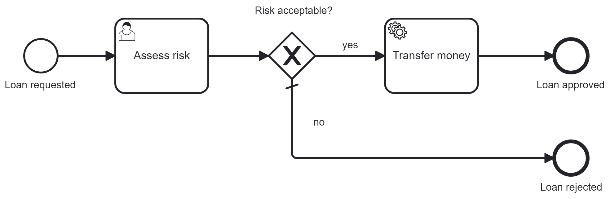

# blueprint-workflowmodule-springboot-standalone

A **blueprint** of a standalone Spring Boot application demonstrating how to integrate [VanillaBP SPI](https://github.com/vanillabp/spi-for-java) for BPMN-based workflows. This example covers a very minimal set of scenarios for developing business process applications and serves as a starting point for more complex use cases.



## Getting Started

1. **Clone the Repository**
   ```bash
   git clone https://github.com/stephanpellian/blueprint-workflowmodule-springboot-standalone.git
    ```
2. **Build the Project**
   ```bash
   mvn clean install
    ```
3. **Start the Project**
4. **Access the REST API** <br>
   The application starts by default on [http://localhost:8080](http://localhost:8080)

## Usage

The demo exposes a REST-API:

* *Start the workflow:* e.g. [http://localhost:8080](http://localhost:8080/)

## Noteworthy & Contributors

VanillaBP was developed by [Phactum](https://www.phactum.at) with the intention of giving back to the community as it has benefited the community in the past.


## License

Copyright 2022 Phactum Softwareentwicklung GmbH

Licensed under the Apache License, Version 2.0