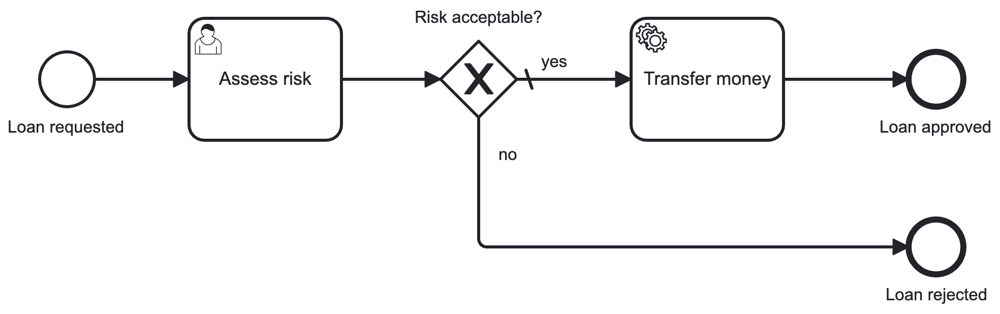

# Blueprint "Standalone"

A **blueprint** of a standalone Spring Boot application demonstrating how to
use the [VanillaBP SPI](https://github.com/vanillabp/spi-for-java) for BPMN-based workflows.

In order to develop a better understanding of how to use VanillaBP,
a concrete technical process “loan approval” is used instead of an abstract
demo process. This
example covers a very minimal set of scenarios for developing business process applications and serves as a starting
point for more complex use cases:



## Getting Started

1. **Create an empty project directory and run:**

   ```shell
   mvn archetype:generate \
   -DarchetypeGroupId=io.vanillabp.blueprint \
   -DarchetypeArtifactId=workflowmodule-springboot-standalone-archetype \
   -DgroupId={your.groupId} \
   -DartifactId={your.artifactId} \
   -Dversion={your.version}
   ```

   *Hint:* If you want a specific archetype version add `-DarchetypeVersion={e.g 0.0.1}`
   <br>&nbsp;

2. **Build the application:**

   ```shell
   mvn spotless:apply
   mvn clean package -Pcamunda7
   ```
3. **Start the application:**

   ```shell
   java -jar target/loan-approval.jar --spring.profiles.active=camunda7
   ```

## Using the demo

This demo is very simple and does not include a user interface. To go through the
entire loan approval follow these steps:

1. Start processing of loan approval using this URL:<br>
   [http://localhost:8080/api/loan-approval/request-loan-approval?loanAmount=1000](http://localhost:8080/api/loan-approval/request-loan-approval?loanAmount=1000)<br>
   As a result you will get the loan approval's request ID needed in subsequent URLs.
2. Checkout logs for retrieving the ID of the user task "Assess risk".
3. Complete the user task by either accepting or denying the risk by this URL:<br>
   [http://localhost:8080/api/loan-approval/{loanRequestId}/assess-risk/{taskId}?riskIsAcceptable=true](http://localhost:8080/api/loan-approval/{loanRequestId}/assess-risk/{taskId}?riskIsAcceptable=true)<br>
   (replace placeholders by the values collected in previous steps)
4. The service task "Transfer money" is executed depending on the value chosen for "riskIsAcceptable".

*Hints:*
- To see currently running processes use [your local Camunda 7 Cockpit](http://localhost:8080/camunda).
- For running this demo using Camunda 8 checkout [Camunda 8 README](./CAMUNDA8.md#setup-instructions).
- For understanding the given Spring Boot configuration files read VanillaBP docs
for [VanillaBP Spring Boot support](https://github.com/vanillabp/spring-boot-support)
and [VanillaBP Camunda 7 adapter](https://github.com/camunda-community-hub/vanillabp-camunda7-adapter/tree/main/spring-boot).

## Interesting to know

The default Maven profile is `camunda7`, which includes the [Camunda 7 adapter](https://github.com/camunda-community-hub/vanillabp-camunda7-adapter) dependency.
Additionally, a Spring profile `camunda7` needs to be used at runtime providing proper configuration.
For **Camunda 8** the respective profile `camunda8` has to be used.
Refer to the [specific README](./CAMUNDA8.md) since additional setup is required.

The components included in this blueprint are structured based on content-related criteria.
This is intentional to promote modularity and maintainability.
As an example, a fictional process based `loan-approval` is implemented. On developing your own
use-cases each independent use case needs it's own [aggregate](https://github.com/vanillabp/spi-for-java#process-specific-workflow-aggregate),
repository, API controller and service placed in its own Java package.
By keeping use cases separate, it becomes easier to extend the application, manage dependencies, and keep clear boundaries between different features.

This blueprint is about a single [workflow module](https://github.com/vanillabp/spring-boot-support#workflow-modules).
If you are interested in implementing multiple workflow modules, you should take a look at other blueprints that cover
these scenarios.

Other concepts VanillaBP is based on can be found in [VanillaBP SPI documentation](https://github.com/vanillabp/spi-for-java#concept).

## Building an application for your own use case

If you want to use the project generated based on this archetype
as a base for your use case, then

1. choose a proper identifier for your business use case.
2. rename the Java package `blueprint.workflowmodule.standalone.loanapproval` according to your
   projects package and use case identifier (e.g. `com.mycompany.myusecase`).
3. search case-insensitive in all files for all occurrences of
   `loanapproval` or `loan-approval` and replace it by the identifier of your
   use case.
4. place your BPMN file in the directory
   `src/main/resources/processes/camunda7` and change the annotation `@BpmnProcess`
   found in Java class `service` pointing to your BPMN file's name.

## Noteworthy & Contributors

VanillaBP was developed by [Phactum](https://www.phactum.at) with the intention of giving back to the community as it has benefited the community in the past.\


## License

Copyright 2025 Phactum Softwareentwicklung GmbH

Licensed under the Apache License, Version 2.0
